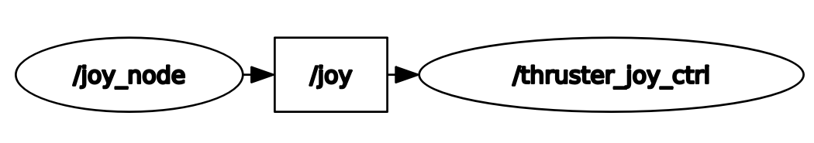
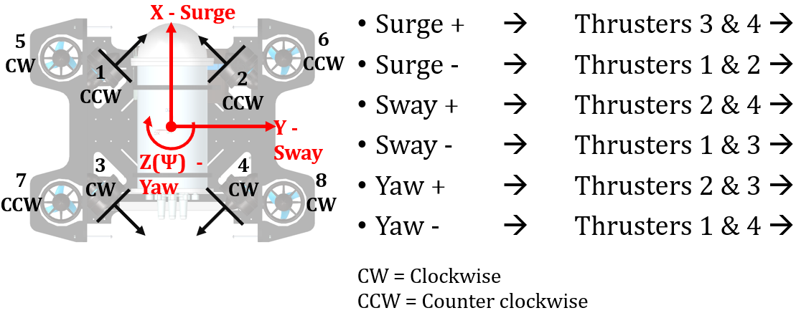
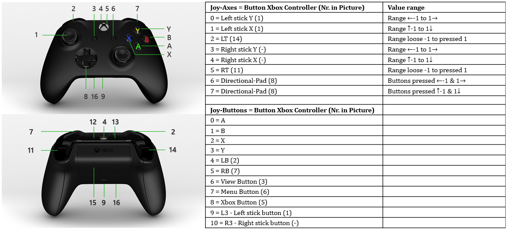
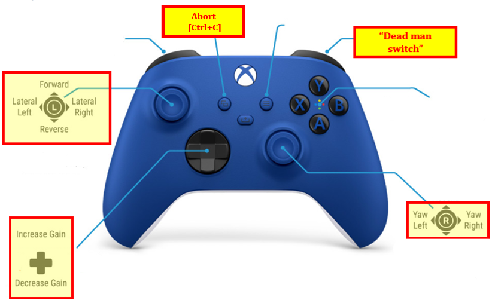

# Teleop Joy Motion Control

This package is designed to control the movement of the UWR with a xbox controller remotely from a notebook or similar, ssh connected to a raspberry pi in the UWR, using a xbox controller with ROS noetic. The controller used is a Xbox one wireless controller in combination with a xbox wireless adapter. It is designed to perform simple pitch, roll or yaw 2D movements with the UWR for positioning purposes in a pool. Two packages are used for this motion control. The ROS BCD licensed joy package and the self developed thruster_joy_ctrl package.



## Prerequisites

- [Ubuntu 20.04](https://releases.ubuntu.com/focal/)
- [ROS Noetic](https://wiki.ros.org/noetic/Installation) (It is recommended to install "desktop-full" version)
- [Git](https://github.com/git-guides/install-git) with SSH key
- [Visual Studio Code](https://code.visualstudio.com/download) (optional)

## Getting started

In order to run the thruster joy control, the joy package, Xone-Linux kernel drive and the 2023_UWR repo must be installed/cloned.

### UWR

The UWR has eight different thrusters to control movement. Thrusters 1-4 are used for movements in the X-Y plane and thrusters 5-8 for movements in the X-Z and Y-Z planes. For the purposes of this package, only the 2D movements carried out by thrusters 1-4 are relevant. The rest of the thrusters are set to no motion.  The figure below shows the arrangement of the thrusters, including their orientation (clockwise or counterclockwise) and 2D motion information.



### Xone

Xone is linux kernel driver for xbox accessories. By default the xbox controller and the wireless adapter won't work in linux, which makes this kernel driver essential for the controll of the UWR. Follow the instructions in the git repo of [xone](https://github.com/medusalix/xone) for installation and setup.

### Joy package 

Joy is a on ROS Wiki published and BSD-licensed package. It is a ROS driver which contains a node that connects a generic linux joystick to ROS. The joy_node publishes the current states of the joystick buttons and axes to the /joy topic in the sensor_msgs/Joy format. For further information about the code of the package, please consult the [joy](https://wiki.ros.org/joy).

For installation and configuration of the joystick please follow the ["ConfiguringALinuxJoystick-Tutorial"](https://wiki.ros.org/joy/Tutorials/ConfiguringALinuxJoystick). Be sure to use the ```sudo apt-get install ros-noetic-joy``` command for installation, since ROS noetic is used for the thruster joystick control.

The joy message published to the /joy topic is the format below. There are two arrays published, one for the axes and one for the buttons.

```
header: 
  seq: 9416
  stamp: 
    secs: 1325530130
    nsecs: 146351623
  frame_id: ''
axes: [0, 0, 0, 0, 0, 0, 0, 0]
buttons: [0, 0, 0, 0, 0, 0, 0, 0, 0, 0, 0, 0]
```
The picture bellow shows the button mapping of the xbox controller, when connected to the joy node:



*Source pictures: Microsoft, “Microsoft Xbox,” [Online](https://support.xbox.com/en-US/help/hardware-network/controller/xbox-one-wireless-controller). [Accessed 27 October 2023]*

### thruster_joy_ctrl

Installation:
- Thruster_joy_ctrl is part of the 2023_UWR respo. Download this repo with:
```
git clone git@github.com:SAAB-NTU/2023_UWR.git
```
Thruster_joy_ctrl is a ROS package that translates sensor_msgs/Joy into pwm signals to control the UWR thruster for 2D motion of pitch, roll and yaw. Running Thruster_joy_ctrl.py opens and configures the serial port. The PWM transceiver has the following parameters:
- Bauderate: 9600
- Bytesize: 8
- Stopbits: 1
- CRC: None

The thruster_control_class, when instantiated, sets all bit values to be sent from the eight thrusters to zero, the pwm duty cycle of 75%, for no motion. This class receives the axes and button values of the controller in the callback function via the dictionary "sensor_data" and the self.set_pwm function converts them into bits which are returned via self.pwmsignals in the format:
```
{"A": self.thruster_1, "B": self.thruster_2, "C": self.thruster_3, "D": self.thruster_4, "E": 0, "F": 0, "G": 0, "H": 0, "R": 0}
```
This dictionary is converted to JSON format and sent to the pwm transceiver board via the serial port using the send_pwm function. Keys 'E' to 'F' control thrusters 5-8 to no motion. The formula used to calculate the PWM duty cycle is shown in the formula below.  
```
$$
\text{PWM Duty Cycle} = \left( \frac{191 + \text{value}}{256} \right) \times 100\%
$$
```
The formula used in the code to calculate the bits for the duty cycle change is derived from the formula below. It is set up in such a way that the value x transferred by the controller causes a 2.5% increase in the duty cycle. Increasing/decreasing the velocity with the xbox controller results in 2.5% increments.
```
$$
\frac{1500}{2000} \times 100\% + x \times 2.5\% = \frac{(191 + y)}{256} \times 100\%
$$

$$
y = 6.4 \times x + 1
$$
```
The listener function initializes the node "thruster_joy_ctrl" and subscribes to the /joy topic through the callback function and keeps running until the node is shut down.

## Usage

1. Open a terminal in Ubuntu
2. SSH from notebook into the UWR-Raspberry Pi
 ```
ssh user@rpi-ip
 ```
3. Change directory to the ROS workspace
4. Run in SSH terminal:
 ```
rm -r devel # Just run during the first time setting up. Deletes devel folder in rs_ws because of device specific symbolic links.
rm -r build # Just run during the first time setting up. Deletes build folder in rs_ws because of device specific symbolic links.
catkin_make
source devel/setup.bash
export ROS_MASTER_URI=http://rpi-ip:11311/
export ROS_IP=rpi-ip
 ```
5. Open a new ssh terminal and run:
```
roscore
 ```
6. Open a new terminal on the notebook change directory to the ROS workspace and run:
 ```
rm -r devel # Just run during the first time setting up. Deletes devel folder in rs_ws because of device specific symbolic links.
rm -r build # Just run during the first time setting up. Deletes build folder in rs_ws because of device specific symbolic links.
catkin_make
source devel/setup.bash
export ROS_MASTER_URI=http://rpi-ip:11311/
export ROS_IP=notebookip
 ```
7. Connect xbox controller to notebook and run:
 ```
roslaunch thruster_joy_ctrl joy_node.launch
```
8. Run in the first ssh terminal:
 ```
rosrun thruster_joy_ctrl thruster_joy_ctrl.py
```
9. If the nodes are connected successfully and the controller is being used the terminal output is:
```
PWM sent successfully
[INFO] [1698994477.657370]: Fri Nov  3 14:54:37 2023
                 {'A': 7, 'B': 0, 'C': 7, 'D': 0, 'E': 0, 'F': 0, 'G': 0, 'H': 0, 'R': 0}
```
10. Controlling the UWR with the xbox controller is now possible. The functions assigned to the buttons and axes are the following:



*Source picture: Bluerobotics, “Bluerobotics” [Online](https://bluerobotics.com/learn/bluerov2-operation/, ). [Accessed 19 October 2023] (with own edits)*

Note: The movements can just be executed individually.

11. If your are finished with the motion control input 'Ctrl+C' in the terminal or use the view button and the nodes are closed.